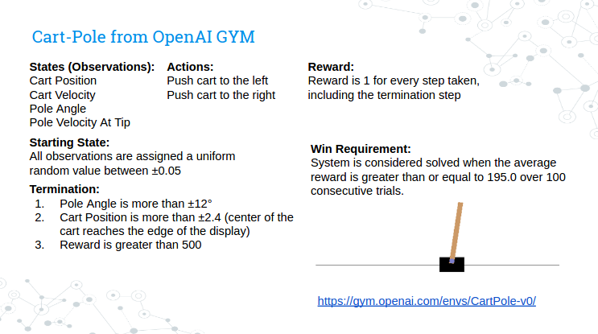
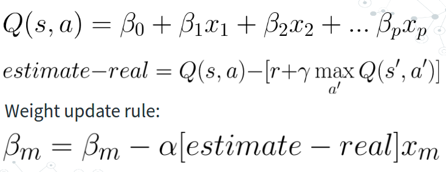
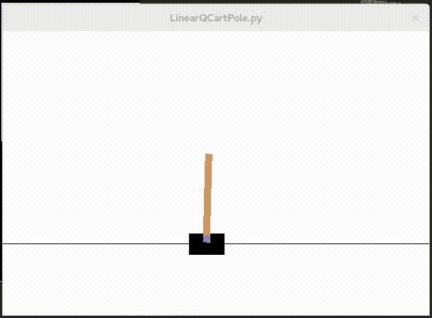
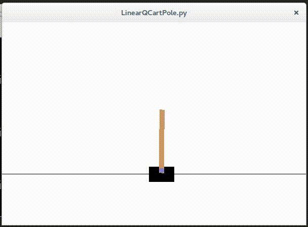

# CartPoleQLearning

## Q learning agent that learns to master Cart Pole system

### game stops after 500 steps

### This agent consistently solves the system (gets an average of 195 or greater reward over 100 consecutive trials) at around trial 120-150

## Linear function and optimization process

## Clip of agent learning to play

## Clip of perfect solution found by agent (Achieves maximum 500 reward every trial)

## How to use 
  (requires python3)  
  Show help: python LinearQCartPole.py -h  
  Train a new agent: python LinearQCartPole.py [episodes]   
  Random Agent: python LinearQCartPole.py [episodes] -random   
  Load in weights: python LinearQCartPole.py [episodes] -f [filename.txt]    
  Test to see average solve times: python LinearQCartPole.py [episodes] -test [number of tests] 

	
